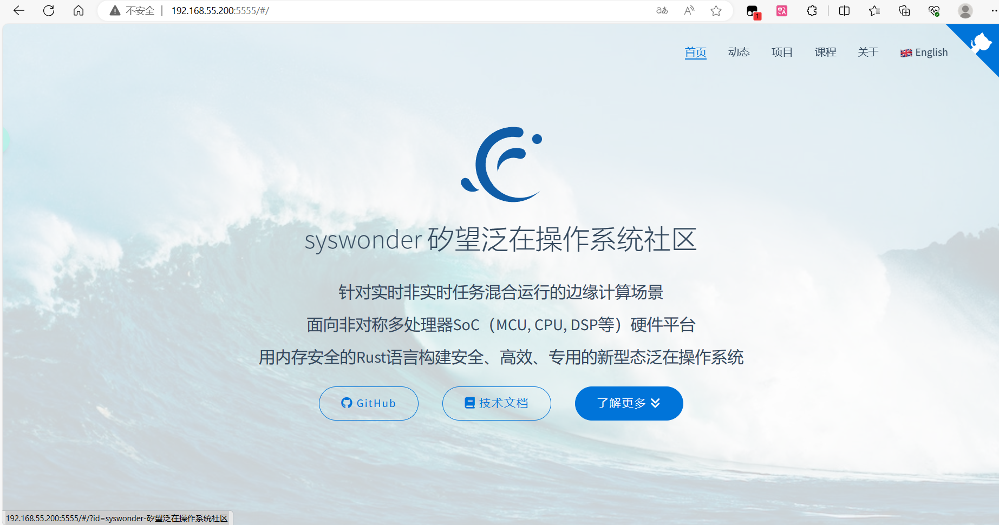

# Nginx

RuxOS supports running  [Nginx](https://www.nginx.com/)build servers on Qemu.

## Clone the Nginx Directory

Run:

```bash
git clone https://github.com/syswonder/rux-nginx.git ./apps/c/nginx
```

This command will clone the makefile and config files related to Nginx into the `apps/c/nginx` directory.

## Running Example

If you just want to test the runnability of nginx and are not concerned about the content it runs, you can directly execute the following command to run the example:

```
bashCopy code
bash ./apps/c/nginx/example_run.sh
```

## Creating a File System Image

When running, it is necessary to ensure the following files exist in the file system:

`/nginx/logs/error.log`

`/nginx/conf/nginx.conf`

`/nginx/conf/mime.types`

Among these, `error.log` is a log file (although it's actually not used), `nginx.conf` is the Nginx configuration file, which tells Nginx how to operate and some operational parameters. `mime.types` is a file type conversion file, informing Nginx how to treat different types of files.

If there is no disk.img in the root directory of RuxOS, an appropriate img will be automatically created during runtime.

If you want to regenerate the image, you can run the create_nginx_img.sh script in the apps/c/nginx directory.

## Creating Webpage Files

When running with default settings, a folder named `html` must be present in the `apps/c/nginx` directory to load the web pages for the Nginx server.

The webpage files can also be set in other paths, see the details below regarding `nginx.conf` and `Using 9pfs`.

## Running Nginx

After completing the steps above, run the following command to start the Nginx server on port 5555.

```shell
make A=apps/c/nginx/ LOG=info NET=y BLK=y ARCH=aarch64 SMP=4 run
```

Parameter explanation:

`A`: This parameter points to the directory where the Nginx application is located.
`LOG`: LOG denotes the log level of the output, with lower log levels meaning more detailed output. Options include: error, warn, info, debug, trace.
`NET`: This parameter enables qemu's virtio-net.
`BLK:` This parameter enables qemu's virtio-blk.
`ARCH`: ARCH indicates which architecture RuxOS is running on, with architectural options including: x86_64, aarch64, riscv64.
`SMP`: SMP enables the multi-core feature of RuxOS, with the number following it indicating the number of cores to launch.
Note, if you have modified the source code or run parameters after the first run, please run the following command to clean up the application files:

```shell
make clean_c A=apps/c/nginx
```

## How to Connect and Test

You can access the web page when visiting the server's port 5555.



## Using Musl libc

By default, RuxOS's Nginx uses a custom C application, ruxlibc.

By adding `MUSL=y` to the run command, you can use the standard musl libc integrated with RuxOS for compilation and linking.

## Using 9pfs

By default, RuxOS passes arguments to applications through the ARGS parameter in the command line, which may be inconvenient. RuxOS has now successfully integrated 9pfs, used for sharing file directories between the host and qemu, so parameters can be passed through the application's own configuration file.

Run the following command:

```shell
make A=apps/c/nginx/ LOG=info NET=y BLK=y FEATURES=virtio-9p V9P=y V9P_PATH=./apps/c/nginx/html/ ARCH=aarch64 SMP=4 run
```

Parameter explanation:

`V9P`: Use V9P=y to enable qemu's virtio-9p backend.
`FEATURES=virtio-9p`: Tells RuxOS to enable the 9p feature.
`V9P_PATH`: V9P_PATH points to the directory on the host that is shared, by default this is the location of the web page files.

## Using HTTPS

By default, nginx is used as an HTTP web server. If you want to use HTTPS, please use the `with_ssl` branch of rux-nginx:

```
bashCopy coderm -rf ./apps/c/nginx
git clone https://github.com/syswonder/rux-nginx.git -b with_ssl ./apps/c/nginx
```

Other running steps remain unchanged.

## nginx.conf

You can modify the nginx.conf file in the apps/c/nginx directory to change the configuration of Nginx, including changing server functions, modifying server parameters, changing Nginx operation options, etc.

Note:

- Functions other than the http server have not been verified.

  

- If you modify server parameters (such as ports), please make corresponding changes to qemu's respective settings (such as port mapping).

  

- After modifying nginx.conf, please copy it to the file system image. You can do this by running ./create_nginx_img.sh in the apps/c/nginx directory.

  

- The nginx.conf used with 9pfs will be different, its content is in apps/c/nginx/nginx_9p.conf. You can copy it to the file system image using the command ./create_nginx_img.sh 9p.